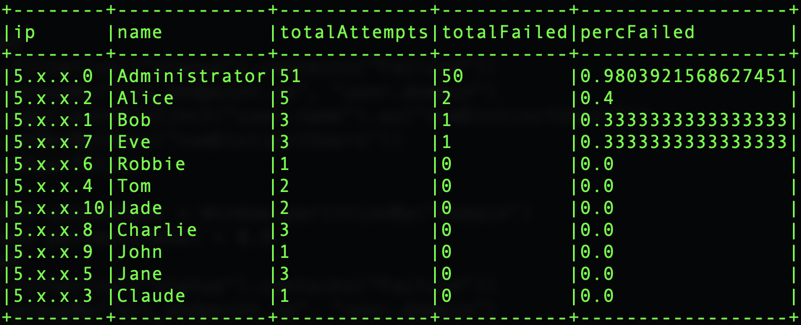
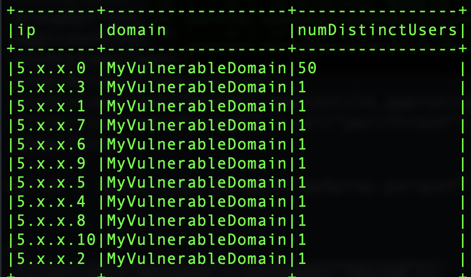

# Spark Use Cases

### Read in Authentication event class parquet data to detect users with a high rate of login failures.
###### ***This could indicative of brute force login attempts.***
```
import org.apache.spark.sql.types.DoubleType
import org.apache.spark.sql.expressions.Window

val df = spark.read.parquet("highFailedLogin.parquet")

val windowSpec = Window.partitionBy("`user.domain`")
val percentileVal = 0.9

val highLoginFailures = df
.withColumn("failedBool", when(col("message").contains("failed"), lit(1)).otherwise(0))
.groupBy("`src_endpoint.ip`", "`user.name`", "`user.domain`")
.agg(count(col("*")).as("totalAttempts"), sum(col("failedBool")).as("totalFailed"))
.withColumn("percFailed", col("totalFailed") / col("totalAttempts").cast(DoubleType))
.orderBy(desc("percFailed"))
.withColumn("percThresh", percentile_approx(col("percFailed"), lit(percentileVal), lit(10000)).over(windowSpec))
.filter(col("percFailed") > col("percThresh"))
```

The original aggregated dataframe prior to filtering and percentile aggregation:


The resulting dataframe after filtering users with login failure rate greater than the 90th percentile:


### Read in Authentication event class parquet data to detect ips failing to log into a high rate of distinct users names. 
###### This could be indicative of password spray.
```
import org.apache.spark.sql.expressions.Window

val df = spark.read.parquet("pwSpray.parquet")

val windowSpec = Window.partitionBy("`user.domain`")
val percentileVal = 0.9

val passwordSprayDf = df
.filter(col("message").contains("failed"))
.groupBy("`src_endpoint.ip`", "`user.domain`")
.agg(countDistinct("`user.name`").as("numDistinctUsers"))
.withColumn("highPerc", percentile_approx(col("numDistinctUsers"), lit(percentileVal), lit(10000)).over(windowSpec))
.filter(col("numDistinctUsers") > col("highPerc"))
```

The original aggregated dataframe prior to filtering and percentile aggregation:



The resulting dataframe after filtering ips with distinct user login failures that were greater than 90th percentile:
