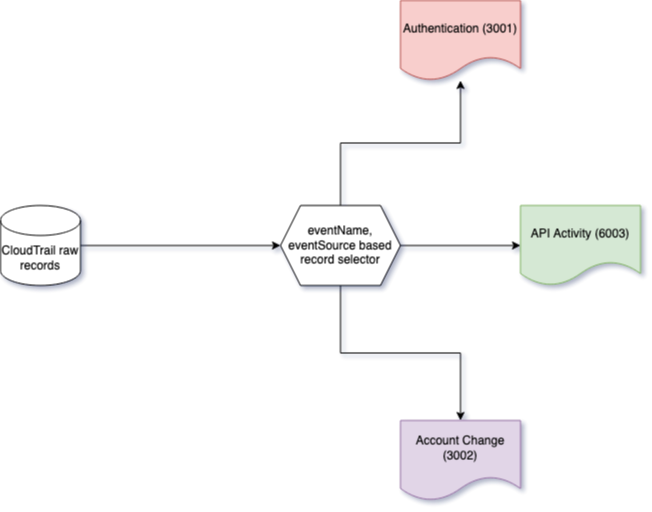

### AWS CloudTrail in OCSF

Cloudtrail is mapped to 3 different classes in OCSF according to the specific domain that an individual cloudtrail record represents. Specific OCSF event classes are selected & mapped to, based on evaluation of `eventName` and `eventSource` fields available in each cloudtrail record. The following image should help visualize the flow.

