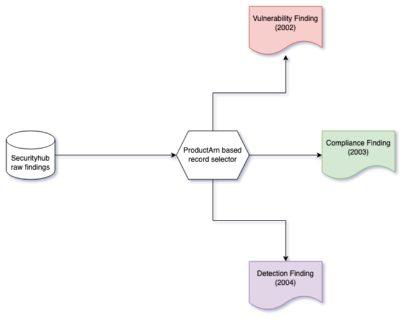

### AWS Security Hub in OCSF

Security Hub findings are mapped to 3 different classes in OCSF according to the specific domain that an individual finding represents. Specific OCSF event classes are selected & mapped to, based on evaluation of `ProductArn` field available in each Security Hub finding. 

1. Vulnerability type findings from Amazon Inspector and other 3rd party providers are mapped to Vulnerability Finding, 2002
2. CSPM type findings from Security Hub and other 3rd party providers are mapped to Compliance Finding, 2003
3. Threat detection type finding from GuardDuty, Macie and other 3rd party providers are mapped to Detection Finding, 2004

The following image should help visualize the flow.

