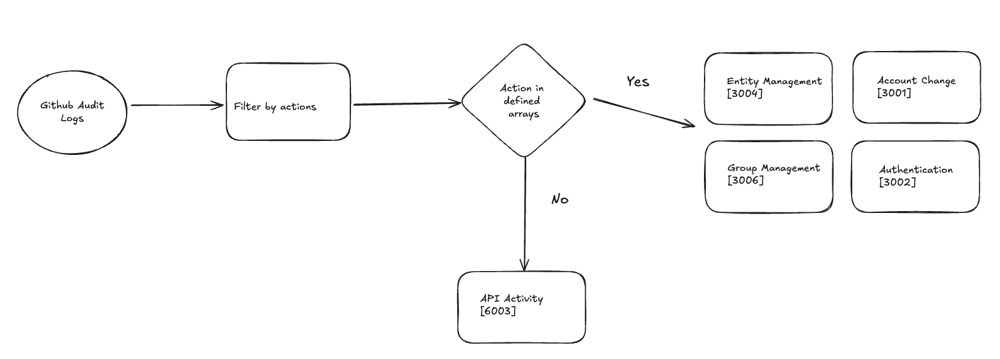

### Github Audit Logs in OCSF

Github audit logs are mapped to 5 different classes in OCSF according to the specific action that an individual Github audit log represents. Specific OCSF event classes are selected & mapped to, based on evaluation of `action` fields available in each system log, to enure that all logs were mapped if an event type did not meet the criteria for a specific class we defaulted to `API Activity [6003]` as this is SaaS product.

Useful resources:

* Mappings in [Google sheets](https://docs.google.com/spreadsheets/d/1U1y5s8MA-xe1HIZt3n9qpJns5eSiyTR_S6dSRe-zL-0/edit?gid=1447247780#gid=1447247780)

* [Audit log events](https://docs.github.com/en/enterprise-cloud@latest/admin/monitoring-activity-in-your-enterprise/reviewing-audit-logs-for-your-enterprise/audit-log-events-for-your-enterprise)

The following image should help visualize the flow.

