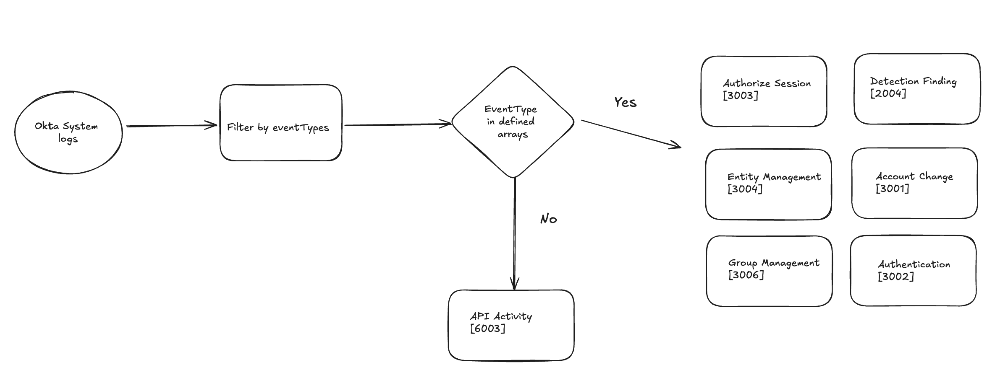

### Okta system logs in OCSF

Okta is mapped to 7 different classes in OCSF according to the specific event type that an individual Okta system log represents. Specific OCSF event classes are selected & mapped to, based on evaluation of `eventType` fields available in each system log, to enure that all logs were mapped if an event type did not meet the criteria for a specific class we defaulted to `API Activity [6003]` as this is SaaS product.

Useful resources:
* Mappings in [Google sheets](https://docs.google.com/spreadsheets/d/1aBZGiWrbgFpbFbpTR4VlspDGy3apt2tj-EEuz1Nd6lE/edit?gid=0#gid=0)
* [System log specification](https://developer.okta.com/docs/reference/api/system-log/)
* [System log  types](https://developer.okta.com/docs/reference/api/event-types/)

The following image should help visualize the flow.

