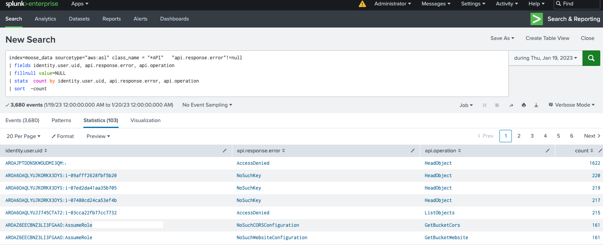
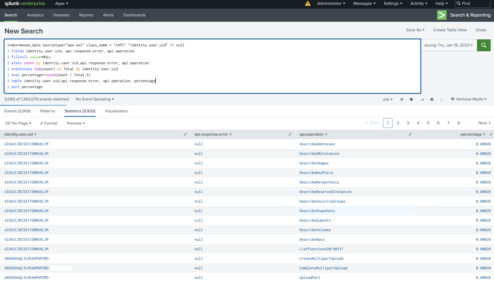
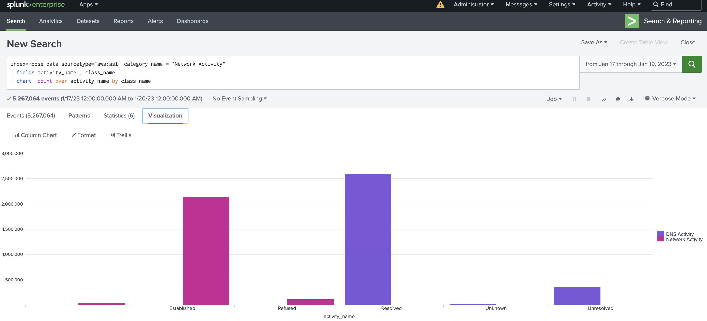
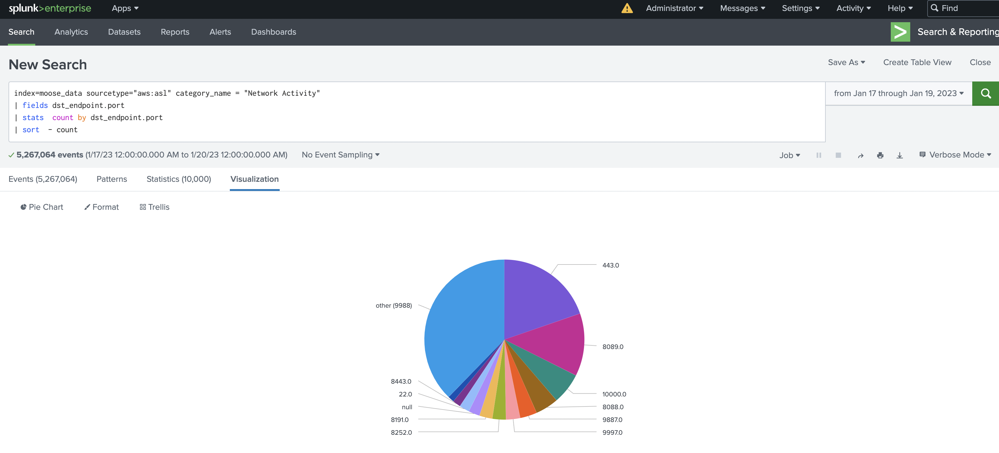
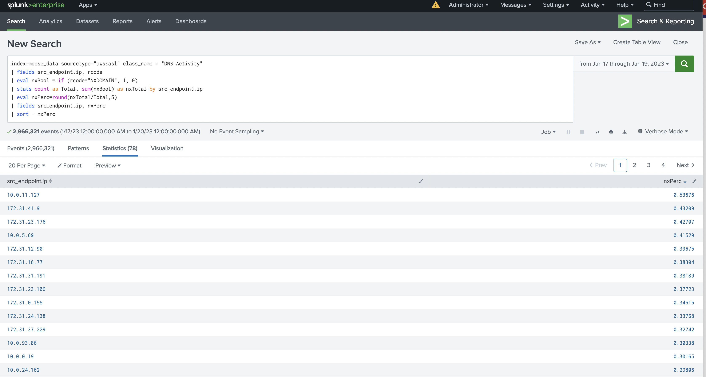

# Splunk Use Cases

### Query all api call data to display users with a high error count

### Query all api call data to display users with rare api calls with respect to their usual behavior

### Query all network activity category data to display activity count by class name

### Query all network activity category data to display dst port distributions

### Query DNS activity event class data to display return code counts over time

### Query DNS activity event class data to display src ips with high NX ratios
